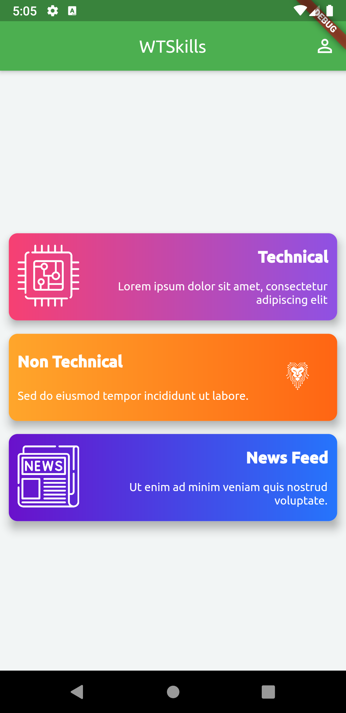

# WTApp

A new project for WittyMinds Online Study App.

### Project Setup

------------

You must to download the Android Studio and Flutter SDK, here we are using IntelliJ IDEA Community Edition 2020.2 x64 everything is same instead of using VScode we are IntelliJ IDEA.

- For Setup this project you follow official documentation here is the link [Flutter Official Doc](https://flutter.dev/docs/get-started/install "Flutter Official Doc").
- After successfully installation of all required software and plugins you have clone this project and open this project on whichever IDE you use.

### Screenshot of App

.

.

.

.

.
